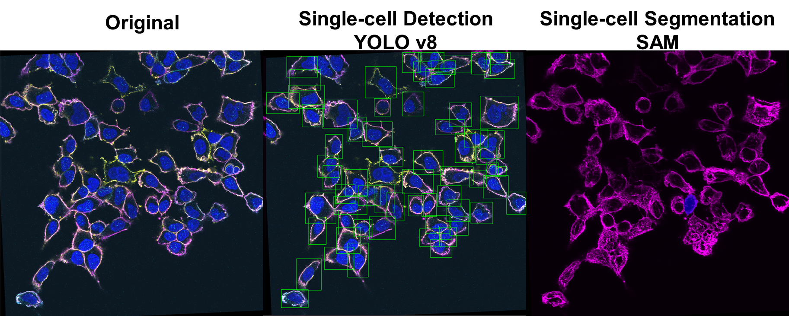

# 4I Pipeline

This project implements a pipeline for analyzing multi-round fluorescence imaging data using YOLO and SAM (Segment Anything Model) for cell detection and segmentation.

**Note: This README.md file was generated by an AI assistant based on the provided Python scripts and ImageJ macro, revised by Long.**

## Table of Contents

1. [Overview](#overview)
2. [Preprocessing](#preprocessing)
3. [File Structure](#file-structure)
4. [Installation](#installation)
5. [Usage](#usage)
6. [Scripts](#scripts)
7. [Output](#output)

## Overview

The 4I Pipeline is designed to process multi-round fluorescence imaging data, detect cells, and analyze their intensities across different imaging rounds. It uses a combination of YOLO (You Only Look Once) for initial cell detection and SAM (Segment Anything Model) for precise cell segmentation. Here is the schematic of the workflow and a sample result of the detection.

<div align=center>



<div align=left>

## Preprocessing
Preprocessing workflow can be found in repository [Preprocessing](https://github.com/letrangerj/Preprocessing.git), the following instruction is a replicate of the readme.md file of that repository.

This workflow consists of four main steps for processing and organizing microscopy images. Below is a detailed explanation of each step and the resulting file structure changes.

The input of the preprocessing workflow comes directly from microscopy exports, and the resulting file arrangement can be used for downstream analysis of *Cell Detection*.

Note for the naming of each microscopy image, the name should contain

1. The treatment (WT/EZH2...)

2. The number of single cell clones

3. The number of frame for each clones

Please adjust the preprocessing pipeline according to your experiment setup.

### Preprocessing Workflow Overview

1. Move files containing certain strings (0_Move_files.py)
2. Organize and rename files (1_Name_process_compressed_simplify.py)
3. Merge and color channels (2_Merge_Batch.ijm)
4. Organize merged images for analysis (3_Move_Formal.py)

### Detailed Workflow

#### Step 1: Move Files (0_Move_files.py)

This script moves files containing a specific string in their name to a new folder.

**Input:**

- Source folder containing .tif files
- String to search for in file names (Typically the treatment, in the case of example data, it should be "WT"/"EZH2"/DNMT")

**Output:**

- New subfolder named after the search string, containing matching .tif filess

**File Structure Change:**

```
src_folder/
├── file1.tif
├── file2.tif
├── ...
└── string/
    ├── file_with_string.tif
    └── ...
```

#### Step 2: Organize and Rename Files (1_Name_process_compressed_simplify.py)

This script organizes files into subfolders based on cell types and channels, then renames them.

**Input:**

- User-selected directory containing image files
- Number of fluorescent channels
- Number of cell types

**Output:**

- Organized folder structure with renamed files
- In this case, -1-1 means the 1st frame of 1st clone, -10-2 means the 2nd frame of 10th clone, etc. The clone and frame information should be noted when doing the microscopy.

**File Structure Change:**

```
selected_directory/
├── -1-1/
│   ├── Channel0/
│   │   ├── 0ch0.png
│   │   └── ...
│   ├── Channel1/
│   │   ├── 0ch1.png
│   │   └── ...
│   └── Merge/
├── -1-2/
│   └── ...
├── -2-1/
│   └── ...
└── ...
```

#### Step 3: Merge and Color Channels (2_Merge_Batch.ijm)

This ImageJ macro colors individual channel images and merges them.

This macro can only run in ImageJ, please put this file under ~/Fiji.app/macros/toolsets/ (the path you store your ImageJ program).

**Input:**

- Directory with subfolders containing channel images (output from Step 2)

**Output:**

- Colored individual channel images
- Merged images for each frame
- Optional: Z-projected stack of merged images

**File Structure Change:**

```
input_directory/
├── -1-1/
│   ├── Channel0/
│   ├── Channel1/
│   └── Merge/
│       ├── Blue0ch0.png
│       ├── Red0ch1.png
│       ├── 0.png (merged)
│       └── ...
├── -1-2/
│   └── ...
└── ...
Stacked.png (optional, in parent directory)
```

#### Step 4: Organize Merged Images (3_Move_Formal.py)

This script organizes the merged images into a structure suitable for analysis.

**Input:**

- Source directory (output from Step 3)s
- Destination directory for analysis
- Round number

**Output:**

- Organized folder structure for analysis

**File Structure Change:**

```
destination_directory/
├── frame_0/
│   └── R1/
│       ├── 0.png
│       ├── xxxch0.png
│       └── ...
├── frame_1/
│   └── R1/
│       └── ...
└── ...
```

### Usage

1. Run `0_Move_files.py` to initially organize your .tif files.
2. Execute `1_Name_process_compressed_simplify.py` to further organize and rename your files.
3. Use ImageJ to run the `2_Merge_Batch.ijm` macro for coloring and merging channels.
4. Finally, run `3_Move_Formal.py` to organize the merged images for analysis.

Make sure to follow the prompts in each script to provide the necessary input, such as directory paths, number of channels, and cell types.

### Requirements

- Python 3.x
- ImageJ with the ability to run macros
- Required Python libraries: `os`, `shutil`, `tkinter`

### Notes

- Ensure that your initial file naming convention is consistent for the scripts to work correctly.
- The ImageJ macro allows for customization of channel colors and merge options.
- Always verify the output at each step before proceeding to the next one.

## File Structure

### Before Image Alignment

The initial file structure, before running the image alignment script, should be as follows (please read the instruction for preprocessing):

```
Origin_path/
├── frame_1/
│   ├── R1/
│   │   ├── 1.png (channel-merged image)
│   │   ├── xxxch0.png (single channel image)
│   │   └── ...
│   ├── R2/
│   ├── R3/
│   └── ...
├── frame_2/
├── frame_3/
└── ...

# ImageJ alignment file for each frame
Origin_path/
├── frame_1/
│   └── TileConfiguration.registered.txt
├── frame_2/
│   └── TileConfiguration.registered.txt
└── ...
```

### After Image Alignment

After running the image alignment script, the file structure will be:

```
Group_path/
├── frame_1/
│   ├── R1/
│   │   ├── 1.png
│   │   ├── 2.png
│   │   └── ...
│   ├── R2/
│   ├── R3/
│   ├── ...
│   └── channels/
│       ├── R1ch0.png
│       ├── R1ch1.png
│       └── ...
├── frame_2/
├── frame_3/
└── ...
```

## Installation

1. Clone this repository
2. Install the required dependencies:
   ```
   pip install ultralytics roboflow opencv-python numpy torch segment-anything tqdm
   ```
3. Download the SAM checkpoint file and place it in the `weights` folder:
   ```
   wget https://dl.fbaipublicfiles.com/segment_anything/sam_vit_h_4b8939.pth -P weights/
   ```

## Usage

1. Ensure your data is organized according to the initial file structure mentioned above (see preprocessing workflow).
2. Run the image alignment script (`1_Image_alignment.py`) to prepare the data for the pipeline.
3. Update the `Group_path` and `Result_path` variables in `main.py` to point to your aligned input and output directories.
4. Run the main script:
   ```
   python main.py
   ```

## Scripts

1. `0_Yolo_Traning.py`: Script for training the YOLO model on cell detection.
2. `1_Image_alignment.py`: Aligns images from different rounds to ensure proper overlap.
3. `2_Yolo_Prediction.py`: Uses the trained YOLO model to predict bounding boxes for cells.
4. `3_SAM_Prediction.py`: Applies the SAM model for precise cell segmentation and intensity measurement.
5. `main.py`: The main script that orchestrates the entire pipeline.

## Pipeline Flow

The 4I Pipeline consists of several interconnected scripts, each performing a specific function in the data processing and analysis workflow. Here's a detailed explanation of each script and how they work together:

1. **YOLO Training (`0_Yolo_Traning.py`)**
   - Function: Trains the YOLO model for cell detection.
   - Input: Annotated cell images from the Roboflow dataset.
   - Output: Trained YOLO model weights.
   - Connection: The trained model is used by `2_Yolo_Prediction.py` for cell detection.

2. **Image Alignment (`1_Image_alignment.py`)**
   - Function: Aligns and stitches images from different imaging rounds.
   - Input: Raw images from each round and ImageJ alignment files.
   - Output: Aligned and stitched images in the `Group_path` directory.
   - Connection: Prepares the data for processing by subsequent scripts.

3. **YOLO Prediction (`2_Yolo_Prediction.py`)**
   - Function: Detects cells and generates bounding boxes.
   - Input: Aligned images from `Group_path`.
   - Output: Bounding box coordinates for detected cells.
   - Connection: Provides input for the SAM model in `3_SAM_Prediction.py`.

4. **SAM Prediction (`3_SAM_Prediction.py`)**
   - Function: Performs precise cell segmentation and intensity measurement.
   - Input: Aligned images and YOLO-generated bounding boxes.
   - Output: Cell intensity measurements and contours.
   - Connection: Generates the final output data for analysis.

5. **Main Script (`main.py`)**
   - Function: Orchestrates the entire pipeline.
   - Input: Aligned images in `Group_path`.
   - Output: Calls functions from other scripts to process all frames and generate final results.
   - Connection: Ties all the scripts together and manages the overall workflow.

### Data Flow:

1. Raw images → Image Alignment → Aligned images
2. Aligned images → YOLO Prediction → Bounding boxes
3. Aligned images + Bounding boxes → SAM Prediction → Intensity measurements and contours

The main script (`main.py`) coordinates this flow, ensuring that each step is executed in the correct order and with the proper inputs.

## Output

The pipeline generates the following outputs in the specified `Result_path`:

1. YOLO prediction images: `f{frame}R{round}_yolo.png`
2. Intensity measurements: `f{frame}_intensity.csv`
3. Cell contours (if enabled): `f{frame}_countour.csv`

The intensity CSV files contain the following information for each cell:
- Cell center coordinates (x, y)
- Intensity measurements for each channel and round

## Note

This pipeline requires that images are pre-aligned using ImageJ. The `1_Image_alignment.py` script uses the ImageJ alignment results to prepare the data for the subsequent steps in the pipeline. Ensure that your input images are properly aligned before running the main pipeline.
